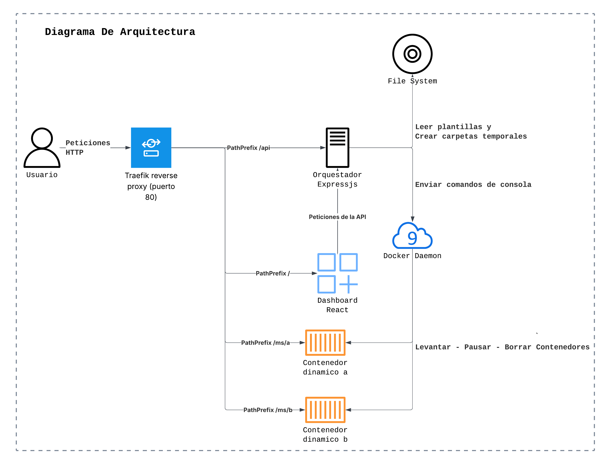
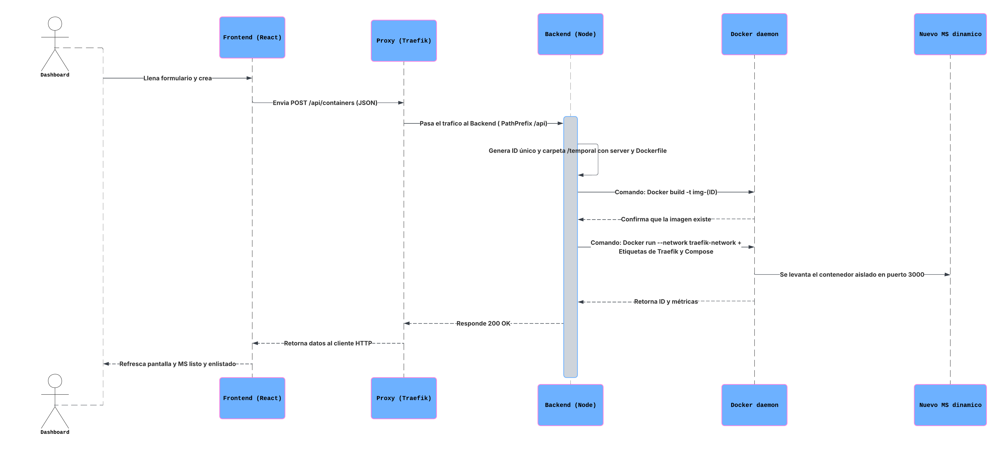

# Proyecto Contenedores 

## Descripcion del proyecto
El objetivo es construir una plataforma basada en Docker y Docker Compose para crear, administrar y eliminar microservicios dinámicamente a través de un dashboard web

### Características de cada microservicio:
- Aplicación independiente empaquetada y ejecutada en su propio contenedor Docker.
- Expone al menos un endpoint HTTP que recibe parámetros y retorna una respuesta en formato JSON.
- Se crea dinámicamente pegando código fuente desde la interfaz web.
- Debe soportar la selección de al menos dos lenguajes de programación.
- No es una función del dashboard, un archivo suelto, ni una ruta adicional del backend principal.

### Requisitos del sistema:

- Construir automáticamente la imagen Docker y desplegar el contenedor.
- Administrar los microservicios existentes (listar, habilitar, deshabilitar y eliminar).
- La solución debe levantarse con un solo comando: `docker-compose up`

### Nuestro Abordaje

Diseñamos una arquitectura cliente-servidor para automatizar los procesos:

1. **Frontend (Dashboard):** Desarrollado en React para la interfaz de usuario donde se pega el código.

2. **Backend (Orquestador en Express.js):**

- **Plantillas base:** Diseñamos un Dockerfile y un servidor web genérico (para Node.js y Python) que garantizan que cualquier código inyectado exponga un puerto y retorne JSON.

- **Servicio Docker:** Usamos el módulo `child_process` de Node.js para que el backend ejecute comandos nativos en la terminal de forma invisible (`docker build, docker run, docker ps, docker rm`).

- **Flujo dinámico:** Al recibir una petición, el backend:
    - Crea una carpeta temporal única
    - Copia la plantilla correspondiente
    - Inyecta el código del usuario
    - Construye la imagen 
    - Levanta el contenedor aisladamente en un puerto disponible.

---
## Video Demostracion
    
[](https://www.youtube.com/watch?v=X9pBvXM56Q4)

[Ver video en youtube](https://www.youtube.com/watch?v=X9pBvXM56Q4)


---
## Diagrama de Arquitectura



---
## Estructura de carpetas

```
PROYECTOCONTENEDORES/
├── frontend/             # Dashboard en React.js
├── backend/              # Orquestador en Express
│   ├── templates/        # Plantillas base (Dockerfile, server.js, server.py)
│   │   ├── nodejs/
│   │   │   ├── Dockerfile
│   │   │   └── server.js
│   │   └── python/
│   │       ├── Dockerfile
│   │       └── server.js        
│   ├── python/
│   │    ├── Dockerfile
│   │    └── server.py
│   ├── src/
│   │   ├── config/       # Configuración global (puertos iniciales etc)
│   │   │   └── docker.config.js
│   │   ├── controllers/  # Recibe la petición del dashboard y responde
│   │   │   └── microservices.controller.js
│   │   ├── routes/       # Rutas de la API (/api/microservices)
│   │   │   └── microservices.routes.js
│   │   └── services/     # Ejecuta comandos de Docker (build, run, stop, rm)
│   │       └── docker.service.js
│   ├── package.json
│   ├── index.js
│   └── Dockerfile        # Imagen del backend
├── docker-compose.yml    # Levanta frontend y backend con un comando 
└── README.md             # Documentación, diagrama y ejemplos
```

---

## Ejecución del Proyecto

1. Asegurarse de tener **Docker Desktop** ejecutándose en tu sistema.
2. Abre una terminal en la raiz del proyecto (Donde se encuentra el `docker-compose.yml`)
3. Ejecuta el siguiente comando:
```
docker-compose up
```
(Nota: Si se desea forzar la reconstrucción de las imágenes tras un cambio de código local, usar `docker-compose up --build`)

4. Una vez que los contenedores estén listos, accede al Dashboard desde tu navegador en: `http://localhost:5173`

---

## Pruebas de la API (Endpoints)

Se puede utilizar Postman, Thunder Client o cURL para interactuar con el orquestador apuntando a `http://localhost:5500/api/microservices`.

* **Crear Microservicio:** `POST /` (Enviar BODY JSON con `name`, `language` (`nodejs` o `python`) y `code`).
* **Listar Microservicios:** `GET /` (Devuelve el estado de todos los contenedores activos).
* **Detener Microservicio:** `POST /:id/stop` (Pausa el contenedor indicado).
* **Iniciar Microservicio:** `POST /:id/start` (Reanuda el contenedor indicado).
* **Eliminar Microservicio:** `DELETE /:id` (Destruye la imagen y el contenedor de tu sistema).



---

## Ejemplos para Probar

Ejemplos funcionales listos para copiar y pegar en la plataforma al momento de crear un servicio

### 1. Hola Mundo (Python)
Seleccionar lenguaje: **Python**
```
def hola():
    return "Hola Mundo"

return hola()
```

### 2. Suma de dos valores (Python)
Seleccionar lenguaje: **Python** 
```
def sumar():
    # Obtener parámetros desde la URL (http://localhost:PuertoDelContenedor/?a=10&b=20)

    a = request.args.get('a', default=0, type=int)
    b = request.args.get('b', default=0, type=int)
    resultado = a + b
    return f"La suma de {a} y {b} es: {resultado}"

return sumar()
```

### 3. Suma de dos valores (Node.js)
Seleccionar lenguaje: **Node.js**
```
// Obtener parámetros desde la URL (http://localhost:PuertoDelContenedor/?a=10&b=20)
const a = parseInt(query.a || 0);
const b = parseInt(query.b || 0);
const resultado = a + b;

return `La suma de ${a} y ${b} es: ${resultado}`;
```

---

### Integrantes Grupo 8: 
- Claudia Elias Sierra
- Carlos Ruidiaz Mendoza
- Juan Fernandez Barrios
- Zenen Contreras Royero
